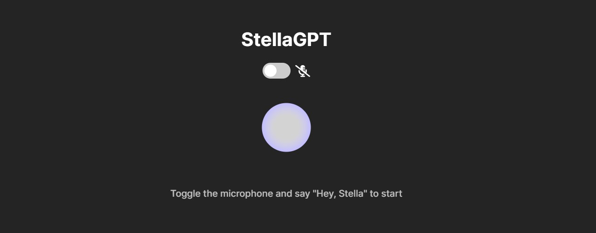
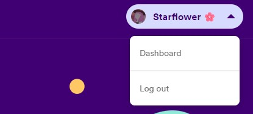
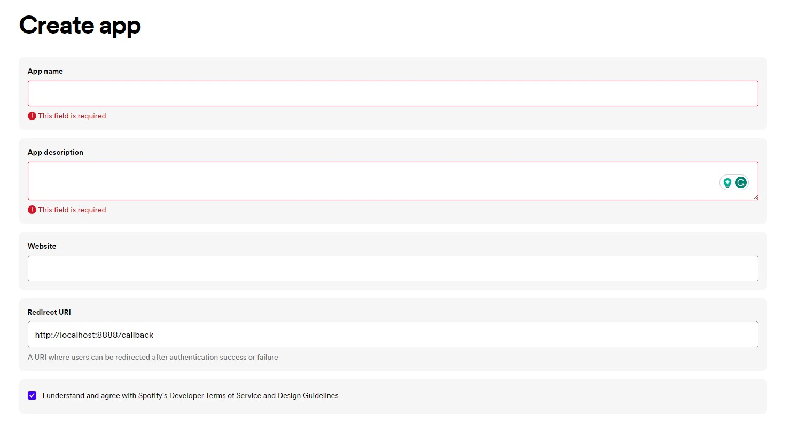
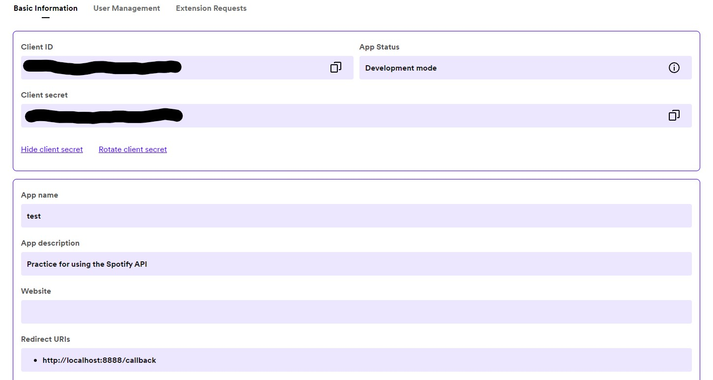

# StellaGPT 🤖



StellaGPT is an AI voice assistant that utilizes the ChatGPT API. Similar to Siri, you can speak to Stella by saying "Hey, Stella".  

### Features
- 🖥️ Open/Close Applications --> Ask Stella to open or close an application on your computer. 
- 🎵 Use Spotify --> Ask Stella to play something on Spotify.  

### External Dependencies

##### 🧠 ChatGPT API

StellaGPT relies on the ChatGPT API for generating responses. This API provides natural language processing capabilities that allow it to engage in conversation, as well as execute commands on the user's computer.
- **API Documentation**: [ChatGPT API Documentation](https://platform.openai.com/docs/introduction)

##### 🗣 ElevenLabs (TTS/Speech Synthesis Software)️
ElevenLabs is used to turn ChatGPT's responses into a realistic sounding human voice.
- **Official API Documentation**: [ElevenLabs API](https://docs.elevenlabs.io/welcome/introduction)
- **ElevenLabs Python Library**: [ElevenLabs Python](https://github.com/elevenlabs/elevenlabs-python)


##### 🎵 Spoti*py* (Python library for the Spotify API)
StellaGPT uses Spotipy to interact with the user's Spotify account and play music on the Spotify application.
- **Official Spotify API Documentation**: [Spotify API Documentation](https://developer.spotify.com/documentation/web-api)
- **Spotipy Python Library**: [Spotipy Library Documentation](https://spotipy.readthedocs.io/en/2.22.1/)

---

## How to use
### Requirements
1. **Python ver. 3.10+** 
2. **API Keys:** 
    - **OpenAI API key** (Required)
    - **ElevenLabs API key** (Optional)
    - **Spotify API key** (Optional)

### ⚡ Quickstart
*(For the steps requiring the terminal, it's best to use either the **Command Prompt** or **Git Bash**)*
1. **Clone the github repository:** You can either download this reporsitory in a zip folder or clone it with the following command:
```
git clone https://github.com/daerese/stella-gpt
```
2. **Start a virtual environment** (optional): If you do not want to to install the packages for this program directly on your machine, then you can use a virtual environment.

*First, confirm that the package **virtualenv** is installed. If not, then install it with this command:*
```
pip install virtualenv
```
*Create the virtual environment:*
```
 python -m venv <virtual-environment-name>
```
*OR you can create it with this command:*
```
virtualenv <virtual-environment-name>
```

*Activate the virual environment:*
- *If you are using the **Git Bash:***
```
source <virtual-environment-name>/Scripts/activate
```
- *If you are using the **Command Prompt:***
```
<virtual-environment-name>\Scripts\activate
```


3. **Install the required python packages:**
```
pip install -r requirements.txt
```


#### 🔑 Setting your API Keys
*Your API keys will be read from a ".env" file.*
1. **In the root directory, create a file called ".env"**
2. **In the file, use the following variables to store your API keys**
```.env
OPENAI_API_KEY = "Your API key"
ELEVENLABS_API_KEY = "Your API key"
```
3. If you don't have these API keys you need to create an account with these websites:
    -  [OpenAI API](https://platform.openai.com/) --> Click on your profile, then navigate to **View API Keys** and create one.
    - [ElevenLabs API](https://elevenlabs.io/)  --> Navigate to **Profile** to view your API key
#### 📻 Spotify API usage (optional)
*To obtain required information for Spotify interactivity, you need to create a project on the **[Spotify for Developers](https://developer.spotify.com/)** website.*
1. Log in, click on your profile and navigate to the **dashboard**


2. Click on **Create App** and enter anything you want into the fields
    - **Redirect URI** --> any valid URL is fine, or you can use ***http://localhost:8888/callback***


3. Once your project has been created, click on **Settings**. You will need the following:
    - **Client ID**
    - **Client Secret**
    - **Redirect URI**


*Copy and paste these into your .env file using the following variable names:*
```.env
SPOTIFY_CLIENT_ID = "Your client id"
SPOTIFY_CLIENT_SECRET = "Your client secret"
SPOTIFY_REDIRECT_URI = "Your redirect URI or http://localhost:8888/callback"
```

#### 🖥️ Running the program
*You will need **two terminals**. One for the main program, and one for the Flask server (this is used to retrieve the text-to-speech audio created from ChatGPT's responses)*
1. **Ensure that the virtual environment is active in both terminals. If not activate it with the command:**
```
<virtual-environment-name>\Scripts\activate
```
2. **Run the flask server in one terminal**
```
python flask_server.py
```
3. **Run the main program in the other terminal**
```
python main.py
```
